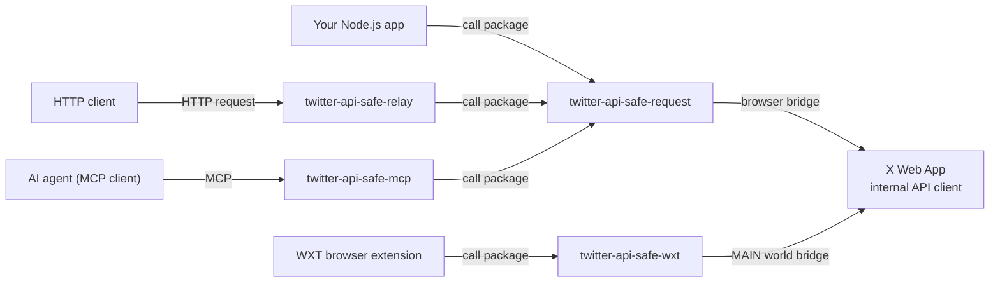

# twitter-api-safe

`twitter-api-safe` is a TypeScript monorepo for sending Twitter/X Web App API requests through a logged-in browser.

The workspace contains five main entry points:

- [`twitter-api-safe-inject`](https://www.npmjs.com/package/twitter-api-safe-inject): the canonical MAIN-world `setup.js` asset shared by Playwright and browser extensions.
- [`twitter-api-safe-request`](https://www.npmjs.com/package/twitter-api-safe-request): an npm package you can use directly from your own Playwright code.
- [`twitter-api-safe-wxt`](https://www.npmjs.com/package/twitter-api-safe-wxt): a WXT adapter for browser extensions.
- [`twitter-api-safe-relay`](https://www.npmjs.com/package/twitter-api-safe-relay): an HTTP relay server that wraps `twitter-api-safe-request`.
- [`twitter-api-safe-mcp`](https://www.npmjs.com/package/twitter-api-safe-mcp): an MCP server that runs the relay and serves MCP in a single process.

The core idea is simple: X.com already has an authenticated Web App API client running in the browser. This project injects a small bridge into that page and lets requests run through that live client instead of reimplementing cookies, CSRF handling, auth state, feature flags, and request behavior in Node.js.



## Use the package directly

Use `twitter-api-safe-request` when you already have a Playwright browser/page and do not need an HTTP server.

```sh
pnpm add twitter-api-safe-request playwright
```

If needed:

```sh
pnpm exec playwright install
```

```ts
import { chromium } from "playwright";
import { createTwitterBrowser } from "twitter-api-safe-request";

const context = await chromium.launchPersistentContext("./user_data/account1", {
  headless: false,
});

const page = await context.newPage();
const client = createTwitterBrowser(page);

await client.inject();
await client.goto("https://x.com/home");

const result = await client.dispatch({
  method: "GET",
  path: "/2/users/me",
  params: {},
});
```

Package README: [`packages/request/README.md`](packages/request/README.md)

npm package page: [`twitter-api-safe-request`](https://www.npmjs.com/package/twitter-api-safe-request)

## Use from a WXT browser extension

Add the module to `wxt.config.ts`:

```ts
export default defineConfig({
  modules: ["twitter-api-safe-wxt/module"],
});
```

Create the browser client from a `document_start` content script:

```ts
import { createTwitterBrowser, TWITTER_MATCHES } from "twitter-api-safe-wxt";

export default defineContentScript({
  matches: [...TWITTER_MATCHES],
  runAt: "document_start",
  allFrames: false,
  async main(ctx) {
    const client = createTwitterBrowser(ctx);
    await client.inject();
    await client.waitStartup();
    const result = await client.dispatch({
      method: "GET",
      path: "/2/example",
      params: {},
    });
    console.log(result);
  },
});
```

Package README: [`packages/wxt/README.md`](packages/wxt/README.md)

npm package page: [`twitter-api-safe-wxt`](https://www.npmjs.com/package/twitter-api-safe-wxt)

Runnable example: [`examples/basic`](examples/basic)

## Use the HTTP relay

Use `twitter-api-safe-relay` when another process should call the X Web App API over HTTP.

Once the relay is running, replace the X.com origin with the relay origin and keep the path/query/body shape:

You do not need to provide Cookie, CSRF, or x-client-transaction-id yourself; the relay adds those headers automatically.

```txt
https://x.com/i/api/graphql/{queryId}/{operationName}?...
http://localhost:3000/i/api/graphql/{queryId}/{operationName}?...
```

For example:

```sh
curl 'http://localhost:3000/i/api/graphql/gKia-nBM9kwuDEfSDeWMfQ/HomeTimeline'
```

Server README: [`packages/server/README.md`](packages/server/README.md)

npm package page: [`twitter-api-safe-relay`](https://www.npmjs.com/package/twitter-api-safe-relay)

## Use from AI agents (MCP)

`twitter-api-safe-mcp` runs the full relay server (HTTP API + dashboard) and serves MCP in a single process. It exposes `list_profiles` and `twitter_api_request` tools.

```sh
claude mcp add twitter-api-safe -- pnpx twitter-api-safe-mcp ./settings.json
```

Package README: [`packages/mcp/README.md`](packages/mcp/README.md)

npm package page: [`twitter-api-safe-mcp`](https://www.npmjs.com/package/twitter-api-safe-mcp)

## Use from AI agents (Agent Skills)

[`twitter_api_safe_relay_skills`](https://github.com/fa0311/twitter_api_safe_relay_skills) provides Agent Skills for Claude Code and other agents, letting an AI turn natural-language instructions into relay-server GraphQL / v1.1 calls and summarize the results.

```sh
npx skills add fa0311/twitter_api_safe_relay_skills
```

Start the relay server, then point the skill at it with the `TWITTER_RELAY_BASE_URL` environment variable. The agent only sees the operation catalog — it never touches cookies, CSRF tokens, or other credentials directly.

## Configuration

Configure the relay in the workspace-level `settings.json`.

```json
{
  "port": 3000,
  "logger": {
    "level": "info"
  },
  "profiles": [
    {
      "name": "account1",
      "browser": {
        "type": "launch",
        "userDataDir": "./../../user_data/account1",
        "headless": false
      }
    }
  ]
}
```

Each profile uses either:

- `launch`: Playwright opens a persistent browser profile. The browser starts on the first request; sign in to X/Twitter when it opens.
- `cdp`: the relay connects to an already-running Chromium browser over the Chrome DevTools Protocol.

## Docker

Images are published to `ghcr.io/fa0311/twitter_api_safe_relay`. Every image has two tags: `latest-<name>` and `<version>-<name>`, where `<version>` is the npm package version (for `init-profile`, a build hash instead).

| Tag (`<name>`)  | Contents                                                                              |
| --------------- | ------------------------------------------------------------------------------------- |
| `relay`         | Relay server with bundled Chromium, for `launch` profiles.                            |
| `relay-slim`    | Relay server without a browser, for `cdp` profiles connecting to an external browser. |
| `relay-firefox` | Relay server with bundled Firefox.                                                    |
| `relay-webkit`  | Relay server with bundled WebKit.                                                     |
| `mcp`           | MCP server (runs the relay + MCP) with bundled Chromium.                              |
| `mcp-slim`      | MCP server without a browser, for `cdp` profiles connecting to an external browser.   |
| `mcp-firefox`   | MCP server with bundled Firefox.                                                      |
| `mcp-webkit`    | MCP server with bundled WebKit.                                                       |
| `init-profile`  | Helper that resets lock files and permissions on the browser profile volume.          |

The compose example in [`docker/`](docker/) runs the relay with the debug dashboard enabled, using `relay-slim` connected over CDP to a [kasmweb](https://hub.docker.com/r/kasmweb/chrome) Chromium container, with `init-profile` preparing the shared profile volume.

```sh
docker compose -f docker/docker-compose.yml up
```

Open the browser UI at `http://localhost:6901`, sign in to X/Twitter, then call the relay or dashboard on `http://localhost:6900`.

## Local development

```sh
pnpm install
pnpm build
pnpm dev:relay
```

This starts the relay server and the Vite UI.

If you use a `launch` profile and do not already have the browser installed:

```sh
pnpm exec playwright install chromium
```

## Tests

```sh
pnpm --filter twitter-api-safe-relay-dashboard test
pnpm --filter twitter-api-safe-request test
pnpm --filter twitter-api-safe-relay test
```
